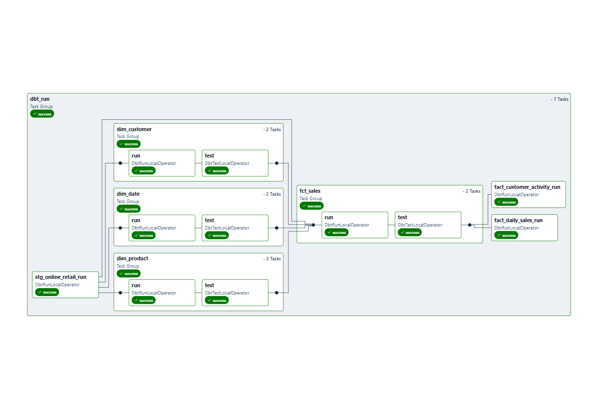

# 🚀 Airflow + dbt + PostgreSQL Data Warehouse Pipeline

### 🧠 Modern Data Engineering Workflow | Automated ELT using Airflow, dbt & PostgreSQL

---

## 📘 Overview

This project demonstrates a **Data Warehouse-style data pipeline** built with **Apache Airflow**, **dbt (Data Build Tool)**, and **PostgreSQL** — showcasing the process of **automating, transforming, and orchestrating** large-scale data with a **Fact & Dimension table structure**.

The pipeline processes and transforms **over 500,000 rows of raw data** stored in PostgreSQL into **clean, analytics-ready Fact and Dimension models** using dbt.
All transformations are automatically orchestrated and monitored through **Apache Airflow DAGs**.

💡 The goal is to simulate a **realistic enterprise-grade Data Warehouse workflow**, where large volumes of data are cleaned, modeled, tested, and made analytics-ready through automated ELT processes.

---

## 🎗️ Architecture Overview

```text
    ┌──────────────────────┐
    │   PostgreSQL (Raw)   │  ← ~500,000 rows of source data
    └──────────┬───────────┘
               │
               ▼
    ┌──────────────────────┐
    │         dbt          │  ← Transforms data into Fact & Dimension tables
    └──────────┬───────────┘
               │
               ▼
    ┌──────────────────────┐
    │     Airflow DAGs     │  ← Orchestration & scheduling
    └──────────────────────┘
```

---

## 🧭 DAG Visualization

Below is the Airflow DAG that orchestrates the dbt pipeline execution:



---

## 📁 Repository Structure

```bash
airflow-dbt-postgres-pipeline/
│
│── dbt_project/                  # dbt project folder
│   ├── models/                   # dbt models for Fact & Dimension transformations
│   ├── schema.yml                # Model documentation & data tests
│   └── dbt_project.yml           # dbt project configuration
│
│── airflow_dags/                 # Airflow DAGs for scheduling dbt jobs
│   └── dbt_core_dag.py           # Main DAG for orchestration
│
│── online_retail_II_dag-graph.png   # DAG visualization
│
│── README.md

```

---

## ⚙️ How It Works

1. **PostgreSQL** hosts around **500K raw data records** loaded from real datasets.
2. **dbt** applies multiple **SQL transformation models** to clean, aggregate, and structure the data into **Fact and Dimension tables**.
3. **Airflow DAGs** orchestrate dbt runs and tests, ensuring tasks execute in the right order.
4. Data quality and lineage are validated using **schema.yml tests** within dbt.
5. Final results are stored in a **PostgreSQL Data Warehouse schema** ready for analytics and reporting.

---

## 🧩 Key Features

✅ Implements a true **Data Warehouse design** (Fact & Dimension tables)
✅ Handles large-scale data (~500,000 rows) efficiently
✅ End-to-end ELT pipeline with modular transformations
✅ Automated scheduling and orchestration using Airflow
✅ Data testing and documentation within dbt
✅ PostgreSQL as both data source and warehouse
✅ Fully extensible and ready for Docker deployment

---

## 🧠 Tech Stack

| Component                 | Purpose                                                 |
| ------------------------- | ------------------------------------------------------- |
| **Apache Airflow**        | Workflow orchestration & scheduling                     |
| **dbt (Data Build Tool)** | SQL-based transformations for Fact & Dimension modeling |
| **PostgreSQL**            | Data source & analytical warehouse                      |
| **Docker**                | Containerized development environment                   |
| **Python**                | Automation and scripting                                |

---

